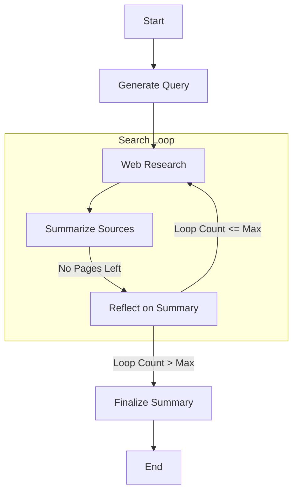

# 🐝 Bee Deep Researcher reproduction

This is a reproduction of the original [Ollama Deep Researcher](https://github.com/langchain-ai/ollama-deep-researcher/blob/main/README.md) from Langchain, built using the [BeeAI Framework](https://i-am-bee.github.io/bee-agent-framework#/). All credits go to the Langchain team for the original work 🙏👏.

### Workflow

## Run

`npm start <<< "How does the PPO RL algorithm work?"`

## Recording

https://github.com/user-attachments/assets/32cd06f3-0739-48ca-8d79-c3233068fca6

